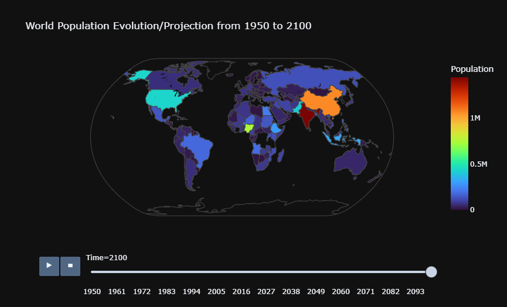
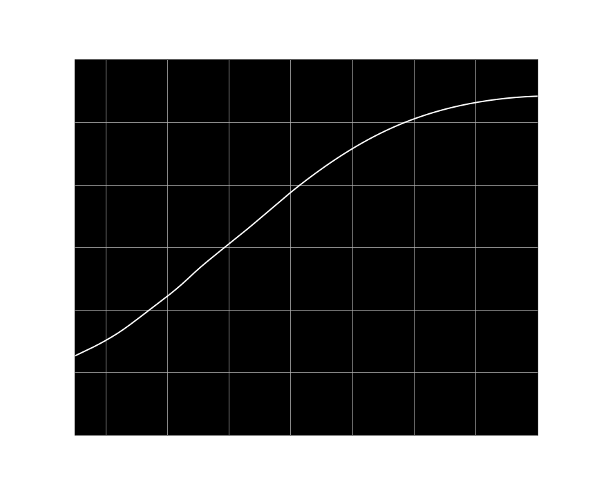

# world_population_evolution
Vizualisation of the world population projection from 1950 to 2100

Data provided by the United Nations and its department of Economic and Social Affairs, with the World Population Prospects 2019.
Please check the website for more details https://population.un.org/wpp/Download/Standard/Population/

## Installation

### Conda Virtual Environment
After downloading the project, open anaconda prompt and write : cd <directory_path>
conda env create -f environment.yml

### Download big data files
To avoid big files on GitHub, the .csv file is not in the data directory.
Download the .csv file on https://population.un.org/wpp/Download/Standard/CSV/ (first link of 21 MB)
Add the .csv file in the directory named data.